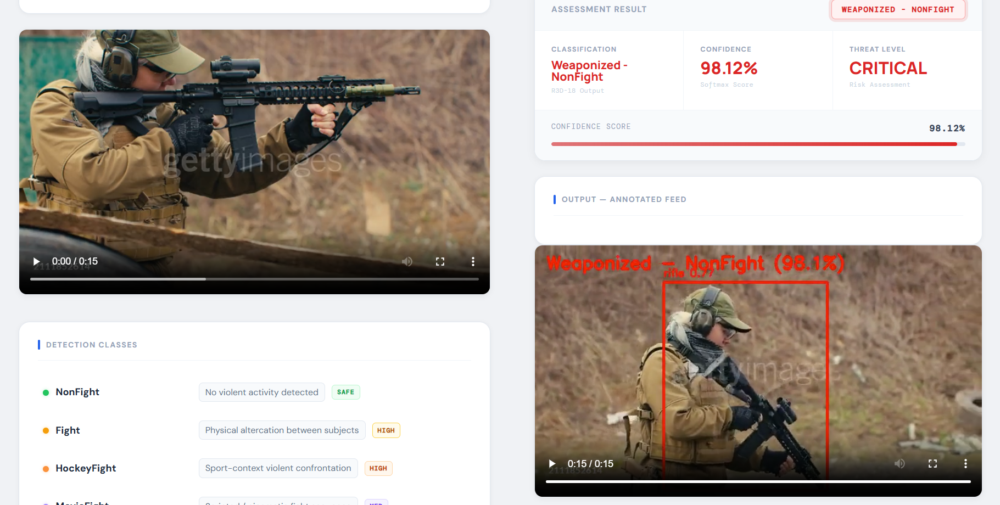
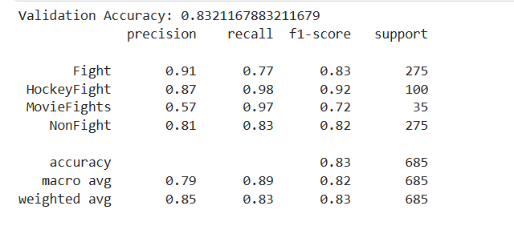
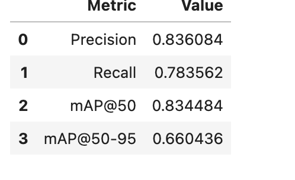

# VIGIL.AI — Automated Violence & Weapon Detection in CCTV:

> **An AI-powered surveillance platform that detects violent activity and weapons in CCTV footage using spatio-temporal deep learning and real-time object detection.**

---

## 📸 Demo:

<p align="center">
  
</p>

<p align="center">
  
</p>

---

## 📌 Project Overview

**VIGIL.AI** is an end-to-end violence and weapon detection system built on top of state-of-the-art deep learning models. It processes CCTV footage through a multi-stage AI pipeline and returns an annotated output video with frame-level classification and bounding boxes.

The system classifies video into **4 violence categories** and detects **4 weapon classes**, providing a structured threat assessment with confidence scoring.

### Detection Classes

| Class | Description | Threat Level |
|-------|-------------|:------------:|
| `NonFight` | No violent activity detected | `SAFE` |
| `Fight` | Physical altercation between subjects | `HIGH` |
| `HockeyFight` | Sport-context violent confrontation | `HIGH` |
| `MovieFight` | Scripted / cinematic fight sequence | `MED` |
| `Weaponized` | Knife · Handgun · Rifle · Launcher detected | `CRITICAL` |

---

## ✨ Key Features

- 🎥 **Violence classification** from CCTV footage across 4 distinct categories
- 🔫 **Weapon detection** — knife, handgun, rifle, launcher via fine-tuned YOLOv8
- 🧠 **Spatio-temporal understanding** using 3D-CNN (R3D-18) with 16-frame sliding window
- 🎯 **Majority-vote smoothing** (5-frame window) to prevent flickering predictions
- ⚡ **Permanent weapon mode** — once a weapon is detected, the label stays active
- 🎬 **Annotated output video** — bounding boxes, labels, and confidence overlays
- 🔄 **FFmpeg-based preprocessing** — auto-converts any input video to a compatible format
- 🚀 **GPU acceleration** support via CUDA
- 🖥 **Professional Streamlit UI (VIGIL.AI)** — responsive across all device sizes
- 📡 **FastAPI backend** with REST endpoint for inference

---

## 🏗 System Architecture

```
CCTV Video Input (.mp4)
        ↓
FFmpeg Video Preprocessing
  (re-encode → yuv420p / libx264)
        ↓
Frame-by-Frame Extraction (OpenCV)
        ↓
  ┌─────────────────────────────┐
  │   YOLOv8 Weapon Detection   │  ← runs every 2nd frame (YOLO_STRIDE=2)
  │   Conf threshold: 0.5       │  ← permanent activation on first detection
  └─────────────────────────────┘
        ↓
  ┌─────────────────────────────┐
  │  R3D-18 Violence Classifier │  ← 16-frame clip window (CLIP_LEN=16)
  │  IMG_SIZE: 112×112          │  ← 4-class softmax output
  │  Smoothing: 5-frame vote    │
  └─────────────────────────────┘
        ↓
Final Label Logic
  ├── Weapon detected → "Weaponized - <ViolenceClass>"  [RED]
  ├── Fight class     → "<FightClass>"                  [ORANGE]
  └── NonFight        → "NonFight"                      [GREEN]
        ↓
Frame Annotation (OpenCV)
  (bounding boxes + label overlay)
        ↓
FFmpeg Output Encoding → .mp4
        ↓
Annotated Video Returned via FastAPI
```

---

## ⚙️ Technologies Used

### AI / Deep Learning
| Library | Usage |
|---------|-------|
| PyTorch | Model training and inference |
| R3D-18 (3D ResNet-18) | Spatio-temporal violence classification |
| YOLOv8 (Ultralytics) | Fine-tuned weapon detection |
| torchvision | Video model backbone |

### Backend
| Library | Usage |
|---------|-------|
| FastAPI | REST API for model inference |
| Uvicorn | ASGI server |
| Python `uuid` | Unique file naming per request |

### Frontend
| Library | Usage |
|---------|-------|
| Streamlit | Interactive web UI (VIGIL.AI) |
| Custom HTML/CSS | Professional dark-theme responsive design |
| Google Fonts | Syne · Inter · JetBrains Mono |

### Video Processing
| Library | Usage |
|---------|-------|
| OpenCV (`cv2`) | Frame extraction and annotation |
| FFmpeg | Video preprocessing and output encoding |

### Utilities
| Library | Usage |
|---------|-------|
| NumPy | Array operations and frame normalization |
| `collections.deque` | Sliding window frame buffer |
| `collections.Counter` | Majority-vote smoothing |

---

## 📸 Models Stats :

<p align="center">
  
</p>

<p align="center">
  
</p>

---

## 📂 Project Structure

```
Violence-Detection-in-CCTV/
│
├── violence-app/
│   ├── backend/
│   │   ├── app.py              # FastAPI server — /predict/ endpoint
│   │   ├── model.py            # Full inference pipeline (R3D-18 + YOLOv8)
│   │   ├── processed_videos/   # Annotated output videos
│   │   └── temp_videos/        # Uploaded input videos (temp)
│   │
│   ├── frontend/
│   │   └── ui.py               # VIGIL.AI Streamlit interface
│   │
│   ├── live_model.py           # Live webcam inference (optional)
│   └── requirements.txt
│
├── README.md
└── LICENSE
```

---

## 🚀 Installation

### 1. Clone Repository

```bash
git clone https://github.com/ash-iiiiish/Violence-Detetion-in-CCTV
cd Violence-Detetion-in-CCTV/violence-app
```

### 2. Create Virtual Environment

```bash
python -m venv venv
```

Activate:

```bash
# Windows
venv\Scripts\activate

# Linux / macOS
source venv/bin/activate
```

### 3. Install Dependencies

```bash
pip install -r requirements.txt
```

### 4. Install FFmpeg

FFmpeg must be installed and available in your system PATH.

```bash
# Windows (via Chocolatey)
choco install ffmpeg

# macOS
brew install ffmpeg

# Ubuntu / Debian
sudo apt install ffmpeg
```

### 5. Set Model Paths

In `backend/model.py`, update the model paths to your local weights:

```python
MODEL_PATH = "path/to/best-violence.pth"   # R3D-18 checkpoint
YOLO_PATH  = "path/to/best-yolo.pt"        # YOLOv8 weights
```

---

## ▶️ Running the Application

### Start Backend

```bash
cd backend
uvicorn app:app --reload
```

Backend runs at: `http://127.0.0.1:8000`

### Start Frontend

```bash
cd frontend
streamlit run ui.py
```

Frontend opens at: `http://localhost:8501`

> ⚠️ **Both servers must be running simultaneously.**

---

## 📡 API Reference

### `POST /predict/`

Upload a video file for violence and weapon detection.

**Request** — `multipart/form-data`

| Field | Type | Description |
|-------|------|-------------|
| `file` | `UploadFile` | `.mp4` video file |

**Response** — `application/json`

```json
{
  "prediction":  "Weaponized - Fight",
  "confidence":  97.43,
  "video_url":   "http://127.0.0.1:8000/videos/processed_1234567890.mp4"
}
```

| Field | Type | Description |
|-------|------|-------------|
| `prediction` | `string` | Final classification label |
| `confidence` | `float` | Softmax confidence score (0–100) |
| `video_url` | `string` | URL to annotated output video |

---

## 🔧 Configuration

Key parameters in `model.py` — adjust these to tune performance:

```python
IMG_SIZE             = 112    # Frame resize resolution
CLIP_LEN             = 16     # Frames per 3D-CNN inference window
YOLO_STRIDE          = 2      # Run YOLO every N frames (performance)
WEAPON_CONF_THRESHOLD = 0.5   # Minimum YOLO confidence to flag a weapon
WEAPON_RELAX_FRAMES  = 30     # Frames before weapon mode can deactivate
VIOLENCE_SMOOTH_COUNT = 5     # Majority-vote window size
```

---

## 📊 Example Workflow

```
1. Open VIGIL.AI at http://localhost:8501
2. Upload any .mp4 CCTV video clip
3. Preview the source feed
4. Click "Run Threat Analysis"
5. Watch the globe inference loader while pipeline runs
6. View Assessment Result:
   - Classification label (NonFight / Fight / HockeyFight / MovieFight / Weaponized)
   - Confidence score (softmax %)
   - Threat level (NONE / HIGH / CRITICAL)
   - Confidence bar
7. Watch the fully annotated output video with bounding boxes
```

---

## ⚠️ Troubleshooting

| Issue | Cause | Fix |
|-------|-------|-----|
| Model not loading | Wrong path in `model.py` | Update `MODEL_PATH` and `YOLO_PATH` |
| CUDA not available | No GPU / wrong PyTorch build | Use CPU mode or reinstall PyTorch with CUDA |
| Video not opening | Unsupported codec | Ensure FFmpeg is installed and in PATH |
| Backend 500 error | Model inference crash | Check terminal logs from `uvicorn` |
| Frontend can't connect | Backend not running | Start `uvicorn app:app --reload` first |
| Output video won't play | Encoding issue | FFmpeg will re-encode to `libx264 / yuv420p` automatically |

---

## 👨‍💻 Contributors

- [@ash-iiiiish](https://github.com/ash-iiiiish)
- [@rhitansh](https://github.com/rhitansh)

---

## 🤝 Contributing

Contributions are welcome!

1. Fork the repository
2. Create your feature branch: `git checkout -b feature/your-feature`
3. Commit your changes: `git commit -m "Add your feature"`
4. Push to the branch: `git push origin feature/your-feature`
5. Submit a pull request

---

## 📄 License

This project is licensed under the terms of the [LICENSE](LICENSE) file.

---

<div align="center">

**⭐ If you found VIGIL.AI useful, please consider giving the repo a star!!!**

Built with PyTorch · R3D-18 · YOLOv8 · FastAPI · Streamlit

</div>


