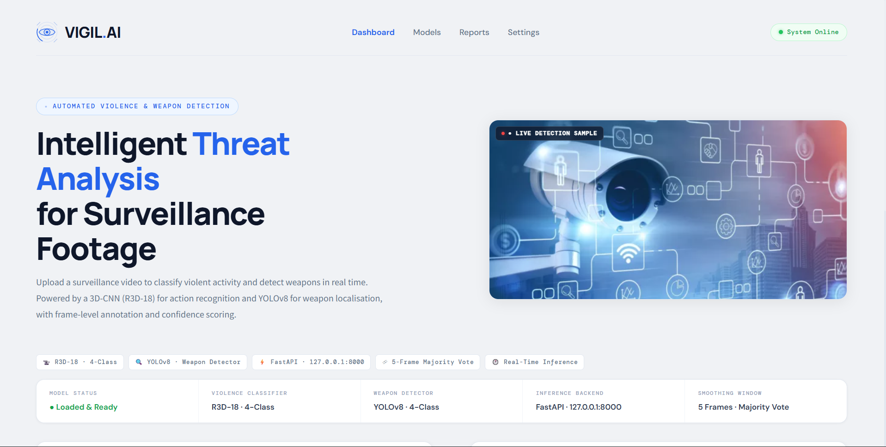

<div align="center">

# 🔍 VIGIL.AI
### Automated Violence & Weapon Detection in CCTV

[](https://python.org)
[](https://pytorch.org)
[](https://ultralytics.com)
[](https://fastapi.tiangolo.com)
[](https://streamlit.io)
[](LICENSE)

<p align="center">
  <strong>Upload any CCTV footage → Detect violence, identify weapons, get threat assessment</strong><br>
  Powered by spatio-temporal deep learning, real-time object detection, and annotated video output — all in one platform.
</p>

---

</div>

## 📌 Overview

**VIGIL.AI** is a production-ready AI surveillance platform that combines spatio-temporal deep learning and real-time object detection to build an intelligent violence and weapon detection system for CCTV footage.

A user uploads a video clip — security camera feed, recorded footage — and the system:
1. **Preprocesses the video** using FFmpeg for format normalization
2. **Detects weapons** using a fine-tuned YOLOv8 model on every other frame
3. **Classifies violence** using R3D-18 (3D ResNet-18) with a 16-frame sliding window
4. **Returns annotated output** with bounding boxes, labels, and a structured threat assessment

> Think of it as **a real-time AI security analyst** that watches footage so humans don't have to.

---



---

## 🏗️ Architecture

```
CCTV Video Input (.mp4)
         │
         ▼
┌─────────────────────┐
│   FFmpeg Preprocess │  Re-encode → yuv420p / libx264
│   Format Normalize  │  Ensures compatibility across all inputs
└──────────┬──────────┘
           │
           ▼
┌─────────────────────┐
│   YOLOv8 Detector   │  Runs every 2nd frame (YOLO_STRIDE=2)
│  Weapon Detection   │  Knife · Handgun · Rifle · Launcher
│                     │  Permanent activation on first detection
└──────────┬──────────┘
           │
           ▼
┌─────────────────────┐
│  R3D-18 Classifier  │  16-frame sliding clip window
│ Violence Detection  │  4-class softmax output
│                     │  5-frame majority-vote smoothing
└──────────┬──────────┘
           │
           ▼
┌─────────────────────┐
│      app.py         │  FastAPI backend + Streamlit dark UI
│  Web Interface      │  Annotated video + threat assessment
└─────────────────────┘
```

---

## 🚀 Tech Stack

| Component | Technology | Purpose |
|-----------|-----------|---------|
| **Violence Classifier** | R3D-18 / 3D ResNet-18 (PyTorch) | Spatio-temporal violence classification |
| **Weapon Detector** | YOLOv8 (Ultralytics) | Fine-tuned knife, gun, rifle, launcher detection |
| **Video Processing** | OpenCV + FFmpeg | Frame extraction, annotation, and encoding |
| **Backend** | FastAPI + Uvicorn | REST API for model inference |
| **Smoothing** | Majority-vote (5-frame window) | Prevent flickering predictions |
| **Framework** | PyTorch + torchvision | Model training and inference |
| **UI** | Streamlit | Web interface |

---

## 📁 Project Structure

```
Violence-Detection-in-CCTV/
│
├── violence-app/
│   ├── backend/
│   │   ├── app.py              → FastAPI server — /predict/ endpoint
│   │   ├── model.py            → Full inference pipeline (R3D-18 + YOLOv8)
│   │   ├── processed_videos/   → Annotated output videos
│   │   └── temp_videos/        → Uploaded input videos (temp)
│   │
│   ├── frontend/
│   │   └── ui.py               → VIGIL.AI Streamlit interface
│   │
│   ├── live_model.py           → Live webcam inference (optional)
│   └── requirements.txt
│
├── README.md
└── LICENSE
```

---

## ⚡ Quick Start

### 1. Clone the repository

```bash
git clone https://github.com/ash-iiiiish/Violence-Detetion-in-CCTV
cd Violence-Detetion-in-CCTV/violence-app
```

### 2. Create a virtual environment

```bash
python -m venv venv

# Windows
venv\Scripts\activate

# Mac / Linux
source venv/bin/activate
```

### 3. Install dependencies

```bash
pip install -r requirements.txt
```

### 4. Install FFmpeg

FFmpeg must be installed and available in your system PATH:

```bash
# Windows (via Chocolatey)
choco install ffmpeg

# macOS
brew install ffmpeg

# Ubuntu / Debian
sudo apt install ffmpeg
```

### 5. Set model paths

In `backend/model.py`, update the paths to your local model weights:

```python
MODEL_PATH = "path/to/best-violence.pth"   # R3D-18 checkpoint
YOLO_PATH  = "path/to/best-yolo.pt"        # YOLOv8 weights
```

### 6. Launch the application

Start the backend:
```bash
cd backend
uvicorn app:app --reload
```

Start the frontend (in a new terminal):
```bash
cd frontend
streamlit run ui.py
```

Open [http://localhost:8501](http://localhost:8501) in your browser.

> ⚠️ **Both servers must be running simultaneously.**

---

## 🎯 Features

### Core Pipeline
- **Multimodal input** — Upload any `.mp4` CCTV video clip
- **Violence classification** — R3D-18 classifies footage across 4 distinct categories
- **Weapon detection** — YOLOv8 identifies knives, handguns, rifles, and launchers
- **Annotated output** — Bounding boxes, labels, and confidence overlays on every frame
- **Threat assessment** — Structured scoring with `SAFE / HIGH / CRITICAL` levels

### Advanced Detection
- **Spatio-temporal understanding** — 3D-CNN processes 16-frame clips to capture motion context
- **Majority-vote smoothing** — 5-frame voting window prevents flickering predictions
- **Permanent weapon mode** — Once a weapon is detected, the label stays active for continuity
- **YOLO stride optimization** — Weapon detection runs every 2nd frame for performance
- **FFmpeg preprocessing** — Auto-converts any input to a compatible format before inference

### UI / UX
- **Dark premium theme** — Professional surveillance-grade interface
- **Globe inference loader** — Animated loader while pipeline runs
- **Confidence bar** — Visual softmax confidence score display
- **Threat level badge** — `NONE / HIGH / CRITICAL` color-coded assessment
- **Annotated video playback** — Watch processed output with bounding boxes directly in browser

---

## 💡 Key Concepts

### Detection Classes

| Class | Description | Threat Level |
|-------|-------------|:------------:|
| `NonFight` | No violent activity detected | `SAFE` |
| `Fight` | Physical altercation between subjects | `HIGH` |
| `HockeyFight` | Sport-context violent confrontation | `HIGH` |
| `MovieFight` | Scripted / cinematic fight sequence | `MED` |
| `Weaponized` | Knife · Handgun · Rifle · Launcher detected | `CRITICAL` |

### Why a Two-Model Pipeline?

| Model | Strength | Role |
|-------|----------|------|
| YOLOv8 (2D) | Fast, frame-level spatial detection | Weapon localization |
| R3D-18 (3D) | Understands motion across time | Violence classification |
| **Combined** | **Spatial + temporal coverage** | — |

### Final Label Logic
```
Weapon detected  →  "Weaponized - <ViolenceClass>"   [RED / CRITICAL]
Fight class      →  "<FightClass>"                   [ORANGE / HIGH]
NonFight         →  "NonFight"                       [GREEN / SAFE]
```

### RAG-Style Inference Pipeline
```
Input Video
   ↓
FFmpeg normalization
   ↓
Per-frame: YOLOv8 → weapon boxes + confidence
   ↓
Per-clip: R3D-18 (16 frames) → violence class + softmax score
   ↓
Majority vote (5-frame window) → smoothed label
   ↓
Final label logic → annotated video + JSON response
```

---

## 🔧 Configuration

All key parameters are in `backend/model.py`:

| Variable | Default | Description |
|----------|---------|-------------|
| `IMG_SIZE` | `112` | Frame resize resolution for R3D-18 |
| `CLIP_LEN` | `16` | Frames per 3D-CNN inference window |
| `YOLO_STRIDE` | `2` | Run YOLO every N frames (performance) |
| `WEAPON_CONF_THRESHOLD` | `0.5` | Minimum YOLO confidence to flag a weapon |
| `WEAPON_RELAX_FRAMES` | `30` | Frames before weapon mode can deactivate |
| `VIOLENCE_SMOOTH_COUNT` | `5` | Majority-vote window size |

---

## 📦 Extending the Platform

**Add new weapon classes** by fine-tuning YOLOv8 on a custom dataset:
```bash
yolo train model=yolov8n.pt data=custom_weapons.yaml epochs=50 imgsz=640
```

**Upgrade the violence classifier** for more categories:
```python
# In model.py — update NUM_CLASSES and retrain R3D-18
NUM_CLASSES = 6   # e.g. add "Robbery", "Vandalism"
```

**Enable live webcam inference:**
```bash
python live_model.py
```

**Hit the REST API directly:**
```bash
curl -X POST "http://127.0.0.1:8000/predict/" \
  -F "file=@your_video.mp4"
```

Expected JSON response:
```json
{
  "prediction":  "Weaponized - Fight",
  "confidence":  97.43,
  "video_url":   "http://127.0.0.1:8000/videos/processed_1234567890.mp4"
}
```

---

## 🛠️ Troubleshooting

| Error | Fix |
|-------|-----|
| `Model not loading` | Update `MODEL_PATH` and `YOLO_PATH` in `model.py` |
| `CUDA not available` | Use CPU mode or reinstall PyTorch with CUDA support |
| `Video not opening` | Ensure FFmpeg is installed and available in system PATH |
| `Backend 500 error` | Check terminal logs from `uvicorn` for traceback |
| `Frontend can't connect` | Start `uvicorn app:app --reload` before launching Streamlit |
| `Output video won't play` | FFmpeg will re-encode to `libx264 / yuv420p` automatically |

---

## 👨‍💻 Contributors

- [@ash-iiiiish](https://github.com/ash-iiiiish)
- [@rhitansh](https://github.com/rhitansh)

## 🤝 Contributing

Contributions are welcome! Fork this repository and submit a pull request.

1. Fork the repository
2. Create your feature branch: `git checkout -b feature/your-feature`
3. Commit your changes: `git commit -m "Add your feature"`
4. Push to the branch: `git push origin feature/your-feature`
5. Submit a pull request

---

## 📄 License

This project is licensed under the MIT License — see the [LICENSE](LICENSE) file for details.

---

<div align="center">

**⭐ If you found VIGIL.AI useful, please consider giving the repo a star**

Built with PyTorch · R3D-18 · YOLOv8 · FastAPI · Streamlit

</div>
